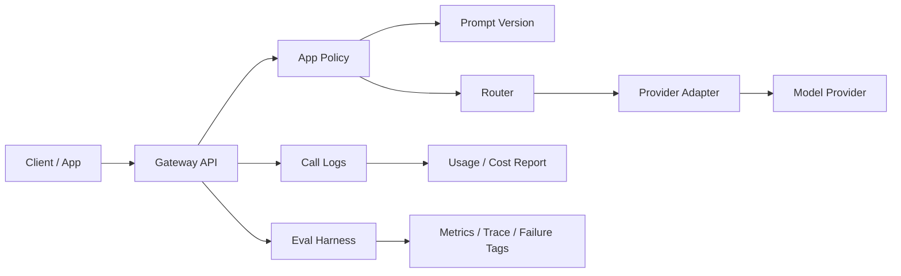

# 项目复盘：大模型调用治理平台

## 项目背景

企业接入大模型时，早期通常只关注“能不能调用模型”。但随着调用量增加，会很快遇到成本不可控、供应商不稳定、错误难排查、客户用量无法核算、Prompt 变更不可追踪等问题。

因此本项目将普通大模型中转能力升级为 LLM Gateway / LLMOps Mini Platform，并增加 Eval Harness V0，让平台具备可重复评测和失败归因能力。

在职业表达上，这个项目也作为 AI Builder 证据：不是只写产品文档，而是能把需求推进到可运行代码、测试、eval、README 和面试复盘。

## 目标用户

- 平台产品/运营：配置模型、应用、预算和路由策略。
- AI 平台产品 / Harness 产品：设计模型接入、降级、评测和质量治理方案。
- 研发/运维：排查调用失败、成本异常、模型耗时问题。
- 企业客户：获得更稳定、可控、可解释的大模型服务。

## 核心问题

- 多模型接入后，如何降低客户调用复杂度？
- 如何在质量、成本、速度之间做路由？
- 供应商失败时如何保证可用性？
- 如何统计客户/应用维度的用量和成本？
- Prompt 修改后，如何定位效果变化？
- 如何为后续 RAG/Agent harness 留下入口？
- 如何把生产 trace、失败 case 和客户反馈回流为评测集？

## 当前实现

- 统一调用入口：`GatewayService.chat`
- 模型配置：`config/models.json`
- 应用配置：`config/apps.json`
- Prompt 版本：`config/prompts.json`
- 调用日志：SQLite `call_logs`
- 路由策略：default、low_cost、fastest、balanced
- fallback：失败后按应用 fallback 列表切换模型
- 成本统计：按输入/输出 token 和模型单价估算
- 预算控制：达到月度预算后降级或拦截
- QPS 限制：按应用统计近期调用
- Eval Harness：批量运行 case、输出通过率、成本、耗时、fallback 次数、trace 和失败归因
- 质量治理入口：为 RAG Evaluation Harness、Agent Harness、发布门禁和生产反馈回流预留结构
- AI Builder 证据：保留代码、测试、配置、README 和后续 AI 辅助开发复盘

## Eval Harness V0 质量门禁设计

当前 Eval Harness 不是单纯跑几个测试样例，而是把“模型调用环境”作为整体来评估：

- case：每个评测样例包含 prompt、route strategy、Prompt version、变量、期望关键词、期望模型/供应商、期望失败标签和 tags。
- rubric：V0 先用可解释规则评分，包括关键词是否满足、工具是否出现、模型/供应商是否符合预期、是否触发预期失败。
- baseline：把某一批稳定 case 的 pass rate、平均成本、平均耗时、fallback 次数作为基线，后续模型、Prompt 或路由策略变更后与基线对比。
- regression：如果同一批 case 的通过率下降、失败归因集中到 Prompt/路由/策略，或成本/耗时明显上升，就视为版本退化。
- CI gate：发布前批量运行核心 case，只有通过率、成本、耗时、fallback 和失败归因都在阈值内，才允许更新 Prompt、模型或路由策略。

V0 已能输出：

- `summary.pass_rate` / `summary.fail_rate`
- `summary.avg_cost_usd` / `summary.avg_latency_ms`
- `summary.fallback_count`
- `summary.failure_breakdown`
- `gate.decision`
- `gate.checks[]`
- `results[].trace.attempts`
- `results[].assertions`

当前已通过 `config/eval_policy.json` 把门禁规则配置化：

| 门禁项 | V0 判断方式 | 面向产品的解释 |
| --- | --- | --- |
| 通过率 | 核心 case pass rate 不低于 baseline | 防止模型/Prompt 更新后旧能力倒退 |
| 成本 | avg_cost_usd 不高于预算阈值 | 防止路由策略让客户毛利失控 |
| 延迟 | avg_latency_ms 不超过体验阈值 | 防止稳定但太慢的模型进入默认链路 |
| fallback | fallback_count 不异常升高 | 发现供应商或模型健康度问题 |
| 失败归因 | failure_breakdown 不集中爆发 | 区分质量、Prompt、路由、策略和模型问题 |

发布判断：

- `allow`：质量、成本、延迟、fallback 和失败归因都在阈值内，可以进入下一步发布。
- `review`：质量通过，但成本、延迟或 fallback 超阈值，需要产品和工程复核。
- `block`：通过率或关键失败标签不达标，不允许发布。

## 成本、质量、稳定性三角权衡

LLM Gateway 的产品核心不是“选择最强模型”，而是在成本、质量和稳定性之间做策略：

| 策略 | 优先目标 | 适用场景 | 风险 | 需要观察的指标 |
| --- | --- | --- | --- | --- |
| low_cost | 成本 | 批量低价值任务、草稿生成、内部辅助 | 质量下降、客户体验不稳定 | pass rate、quality_failure、avg_cost_usd |
| fastest | 速度 | 实时交互、客服助手、前台 Copilot | 可能牺牲复杂任务质量 | avg_latency_ms、timeout、fallback_count |
| balanced | 综合体验 | 默认业务场景、售前方案、知识问答 | 策略解释成本更高 | pass rate、cost、latency、fallback |
| fallback | 可用性 | 供应商异常、模型限流、临时故障 | 成本或效果可能波动 | fallback_count、model_failure、provider |

面试表达重点：平台产品经理不是只做模型列表，而是把模型能力转成可配置、可追踪、可解释、可收费的治理能力。

## 架构草图

## 面试重点

这个项目不是为了展示“我会调用模型”，而是展示我理解企业大模型平台上线后真正需要治理：

- 成本治理
- 稳定性治理
- 多模型策略
- 客户用量核算
- Prompt 变更追踪
- Eval Harness：测试集、批量运行、trace、失败归因
- baseline / rubric / regression / CI gate / release decision：把评测从“看结果”升级为发布门禁
- 生产反馈回流：把 bad case、trace、成本和延迟问题转成后续评测集
- AI Builder：用 AI 辅助开发推进小功能和测试，但用人工产品判断、测试/eval 和复盘控制质量

## 后续增强

- 接入真实模型 API。
- 增加 Redis 限流。
- 增加模型健康度探测。
- 增加租户权限。
- 增加 Web 管理台。
- 将 Eval Harness 升级为 RAG Evaluation Harness。
- 加入 Agent Harness：Tool registry、State、Guardrails、Trace、Recovery、Regression。
- 做 Harness 产品化后台：评测集管理、运行记录、对比实验、人工标注、生产 trace 回流和发布门禁。
- 增加 AI Builder 复盘模板，记录需求、AI 生成、人工审查、测试/eval 结果和产品价值。
