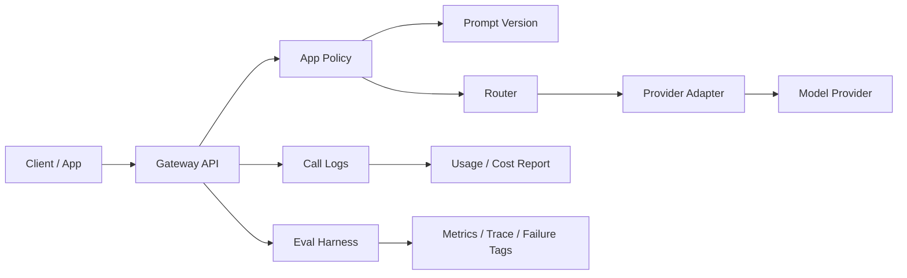

# 项目复盘：大模型调用治理平台

## 项目背景

企业接入大模型时，早期通常只关注“能不能调用模型”。但随着调用量增加，会很快遇到成本不可控、供应商不稳定、错误难排查、客户用量无法核算、Prompt 变更不可追踪等问题。

因此本项目将普通大模型中转能力升级为 LLM Gateway / LLMOps Mini Platform，并增加 Eval Harness V0，让平台具备可重复评测和失败归因能力。

在职业表达上，这个项目也作为 AI Builder 证据：不是只写产品文档，而是能把需求推进到可运行代码、测试、eval、README 和面试复盘。

## 目标用户

- 平台产品/运营：配置模型、应用、预算和路由策略。
- AI 平台产品 / Harness 产品：设计模型接入、降级、评测和质量治理方案。
- 研发/运维：排查调用失败、成本异常、模型耗时问题。
- 企业客户：获得更稳定、可控、可解释的大模型服务。

## 核心问题

- 多模型接入后，如何降低客户调用复杂度？
- 如何在质量、成本、速度之间做路由？
- 供应商失败时如何保证可用性？
- 如何统计客户/应用维度的用量和成本？
- Prompt 修改后，如何定位效果变化？
- 如何为后续 RAG/Agent harness 留下入口？
- 如何把生产 trace、失败 case 和客户反馈回流为评测集？

## 当前实现

- 统一调用入口：`GatewayService.chat`
- 模型配置：`config/models.json`
- 应用配置：`config/apps.json`
- Prompt 版本：`config/prompts.json`
- 调用日志：SQLite `call_logs`
- 路由策略：default、low_cost、fastest、balanced
- fallback：失败后按应用 fallback 列表切换模型
- 成本统计：按输入/输出 token 和模型单价估算
- 预算控制：达到月度预算后降级或拦截
- QPS 限制：按应用统计近期调用
- Eval Harness：批量运行 case、输出通过率、成本、耗时、fallback 次数、trace 和失败归因
- 质量治理入口：为 RAG Evaluation Harness、Agent Harness、发布门禁和生产反馈回流预留结构
- AI Builder 证据：保留代码、测试、配置、README 和后续 AI 辅助开发复盘

## 架构草图

## 面试重点

这个项目不是为了展示“我会调用模型”，而是展示我理解企业大模型平台上线后真正需要治理：

- 成本治理
- 稳定性治理
- 多模型策略
- 客户用量核算
- Prompt 变更追踪
- Eval Harness：测试集、批量运行、trace、失败归因
- 生产反馈回流：把 bad case、trace、成本和延迟问题转成后续评测集
- AI Builder：用 AI 辅助开发推进小功能和测试，但用人工产品判断、测试/eval 和复盘控制质量

## 后续增强

- 接入真实模型 API。
- 增加 Redis 限流。
- 增加模型健康度探测。
- 增加租户权限。
- 增加 Web 管理台。
- 将 Eval Harness 升级为 RAG Evaluation Harness。
- 加入 Agent Harness：Tool registry、State、Guardrails、Trace、Recovery、Regression。
- 做 Harness 产品化后台：评测集管理、运行记录、对比实验、人工标注、生产 trace 回流和发布门禁。
- 增加 AI Builder 复盘模板，记录需求、AI 生成、人工审查、测试/eval 结果和产品价值。
